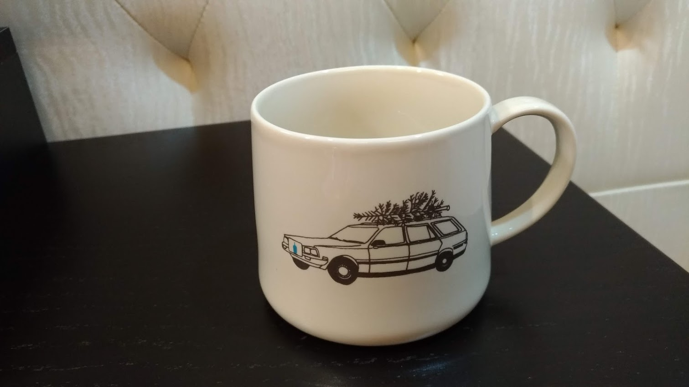

# 前言

>人生就是要享受，不然要幹嘛。


# 今日蝦買

- 今天是微風南山開幕，在他還沒開幕前就一直有消息，而廣告訊息打很大的就屬Blue Bottle了，所謂的藍瓶。說也奇怪，他是美國Coffee，2015日本進駐以後，微風在跟日本atre合作，也跟著進住了藍瓶。有點大的關連。只能說微風魅力很強大。雖然只是快閃店。但也因為是快閃，所以才會搶購，因為之後就可能沒了，我覺得跟關稅有關(後面解釋)，他們的咖啡好不好喝，其實我不知道，但就是因為沒喝過才想喝。
- 店員介紹，他們是手沖咖啡聞名，有五種咖啡豆，我買了Giant Steps跟Bella Donovan。他說Bella賣最好。加上HAYES VALLEY總共3款濃郁的，這兩款都屬於濃郁型。另外還有Hayes Valley Espresso跟THREE AFRICAS，他說偏酸的，所以拒絕購買，其實是水果調的咖啡豆，所以有點酸酸的，好像罐裝的就是這款。

- 隊伍真的很長，而且大家逛很久，入口在箭頭處，我在排隊時大概有5個人左右來問我這排啥!

## 狀況

- 這次真的有亂花錢，但是因為我在外面排太久了，所以不買到個什麼對不起自己，這到底是什麼心態。我後面的夫妻就比較幸運了XD，他們聽到某個穿西裝的不知名人士來說隨身杯賣完嚕，隔一正子又來鋁罐得也快賣完了，應該到你們這就都沒了。還來了兩三次，由於排隊真的很久最後這對夫妻少說排了一小時，決定離去。離去，離去。也是，別像我進去以後亂花錢，大氣的買了4箱鋁罐的咖啡 (我最好喝的完)。沒錯店家還有貨，那個不知名人士真該死，如果我因為這樣離開我會嘔死。但他們也算省到錢了就是。XD，只能幫QQ。

#### 分享

- 最後告訴各位，1月開到7月，第一天隨身杯就賣完，搞什麼，提早撤櫃嗎? 我今天也是這樣問店員，但店員曖昧的低頭，不發一語，哩北心想現在是鴨巴嗎? 不過不難猜想應該是不好意思說謊，明後天立馬捕貨給你看，然後第一天大量購買的就變成傻子了，奉勸大家別亂搶購。

- 戰利品，不是亂嘴砲，是真的有買阿。 

<!--  失敗-->


#### 結論


```

```	
		

